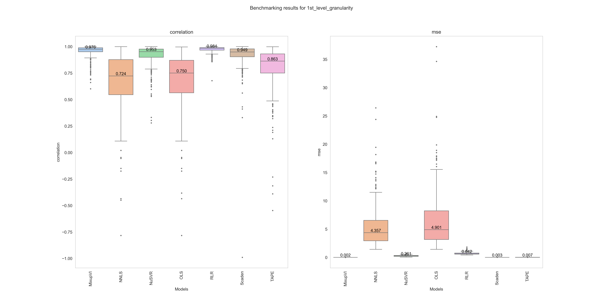
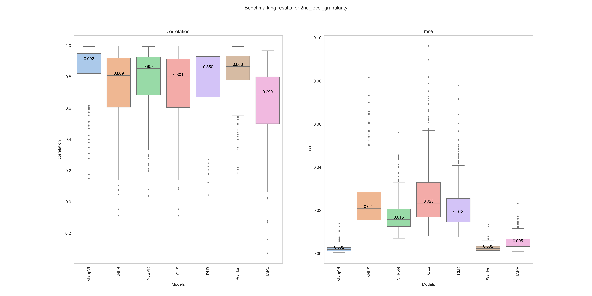

<div style="text-align: center;">
<pre>
           ██████╗  ██╗   ██╗  ██████╗  ███████╗  ██████╗  ██████╗  ███╗   ██╗ ██╗   ██╗
           ██╔══██╗ ╚██╗ ██╔╝  ██╔══██╗ ██╔════╝ ██╔════╝ ██╔═══██╗ ████╗  ██║ ██║   ██║
           ██████╔╝  ╚████╔╝   ██║  ██║ █████╗   ██║      ██║   ██║ ██╔██╗ ██║ ██║   ██║
           ██╔═══╝    ╚██╔╝    ██║  ██║ ██╔══╝   ██║      ██║   ██║ ██║╚██╗██║ ╚██╗ ██╔╝
           ██║         ██║     ██████╔╝ ███████╗ ╚██████╗ ╚██████╔╝ ██║ ╚████║  ╚████╔╝
           ╚═╝         ╚═╝     ╚═════╝  ╚══════╝  ╚═════╝  ╚═════╝  ╚═╝  ╚═══╝   ╚═══╝  
</pre>
</div>
<p align="center"><em>Python implementation of bulk RNAseq deconvolution algorithms</em></p>
<div align="center">
 <a href="https://pypi.owkin.com/#/package/PyDeconv" target="_blank">
  
 </a>

 <a href="https://pypi.org/project/pydeconv/" target="_blank">
  
 </a>

  <a href="https://docs.astral.sh/uv/" target="_blank">
  
 </a>
</div>

# How to install

# package

```shell
pip install pydeconv
```

> [!NOTE]
> If you want to use deep learning models, you need to use pip install "pydeconv[torch]" to install the required dependencies.
> If you want to use mixupVI, you need to use pip install "pydeconv[scvi]" to install the required dependencies.

# dev

```shell
uv sync --all-groups --all-extras
```

# How to use: overview

 ```python
from pydeconv import SignatureMatrix
from pydeconv.model import OLS, NNLS, DWLS, Tape, Scaden, MixupVI, NuSVR, RLR, WNNLS
from adata import AnnData

signature_matrix = SignatureMatrix.load("path/to/signature_matrix.csv") # index: gene names, column: cell types
solver = NNLS(signature_matrix)

adata = AnnData("path/to/adata.h5ad") # index: sample_id, columns: gene_names
adata.layers["raw_counts"] = ... # apply your preprocessing step or not

cell_prop = solver.transform(adata, layer="raw_counts", ratio=True)
```

# How to use: detailed

## 1. Load an already registered signature matrix

```python
from pydeconv.signature_matrix.registry import sig_matrix_laughney_lung_cancer
signature_matrix = sig_matrix_laughney_lung_cancer()
```

> [!NOTE]
> Checkout [here](https://github.com/owkin/PyDeconv/blob/main/src/pydeconv/signature_matrix/registry.py) for more description of other registered signature matrix.

## 2. Load a custom signature matrix

```python
from pydeconv import SignatureMatrix
signature_matrix = SignatureMatrix.load("path/to/signature_matrix.csv") #index: gene names, column: cell types
```

> [!NOTE]
> For the moment only `.csv` format is supported. You can add any kwargs arguments from `pd.read_csv` after the path.

## 3. Predict

```python
from pydeconv.model import Tape, Scaden

adata = AnnData("path/to/adata.h5ad") # index: sample_id, columns: gene_names
adata.layers["counts_sum"] = ...

solver = Scaden(weights_version="cti_2nd_level_granularity")
cell_prop = solver.transform(adata, layer="counts_sum", ratio=True)
```

> [!NOTE]
> The model will check that you have the corresponding gene names in your input data.

## 4. Predict (signature based method)

```python
from pydeconv.model import OLS, NNLS, DWLS

signature_matrix = ...
adata = AnnData("path/to/adata.h5ad")
adata.layers["relative_counts"] = ...

solver = DWLS(signature_matrix)
cell_prop = solver.transform(adata, layer="relative_counts", ratio=True)
```

# Benchmark

We benchmarked the performance of several deconvolution algorithms on the CTI dataset, including our developed method *MixUpVI*.
This repository and the proposed methods are part of the following paper: [Joint probabilistic modeling of pseudobulk and single-cell transcriptomics enables accurate estimation of cell type composition](https://www.biorxiv.org/content/10.1101/2025.05.28.656123v1), published in the *Generative AI & Biology* workshop of ICML, 2025.

The results are shown below.

To run the benchmark, you can use the following command:

```bash
python benchmark/run_benchmark.py
```

> [!NOTE]
> The repository only provides inference capabilities. It does not provide capabilities to train *MixUpVI* and other deep learning methods, or create signature matrices.
> Therefore, we provide the weights from the trained models presented in the publication, and pre-computed signature matrices.
> To use these models on other datasets, one must provide their own weights and/or pre-computed signature matrices.

## Results 1st granularity



## Results 2nd granularity



> [!NOTE]
> These results are computed and guaranteed using the `adata.raw.X` layer of the CTI dataset available on [cellxgene](https://cellxgene.cziscience.com/collections/62ef75e4-cbea-454e-a0ce-998ec40223d3).
> It will be automatically downloaded when running the benchmark.

# Cite

If you found our work useful in your research, please consider citing it at:

```
@inproceedings{
grouard2025joint,
title={Joint Probabilistic Modeling of Pseudobulk and Single-Cell Transcriptomics Enables Accurate Estimation of Cell Composition},
author={Simon Grouard and Khalil Ouardini and Yann Rodriguez and Jean-Philippe Vert and Almudena Espin-Perez},
booktitle={ICML 2025 Generative AI and Biology (GenBio) Workshop},
year={2025},
url={https://openreview.net/forum?id=JhDJ0MGo2z}
}
```
